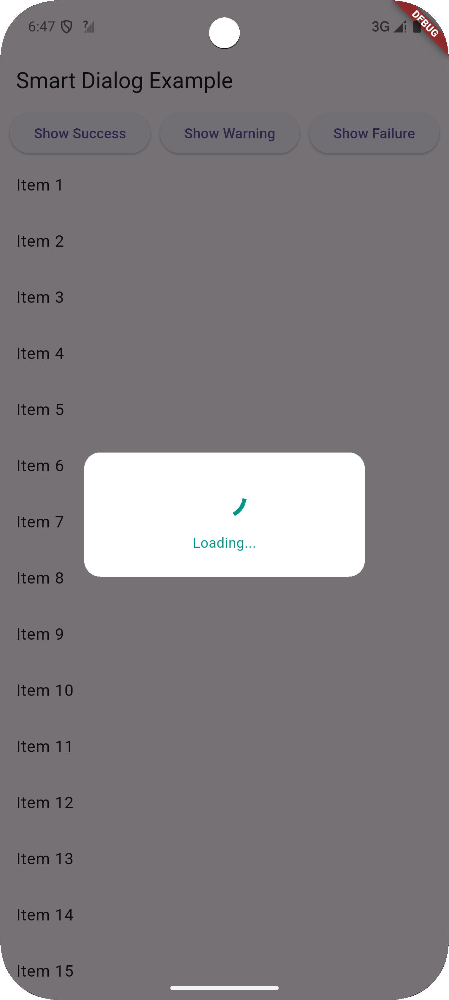
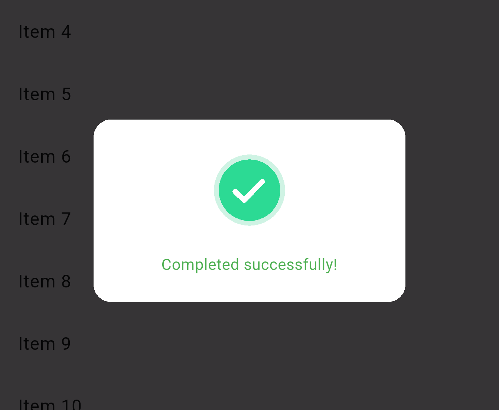
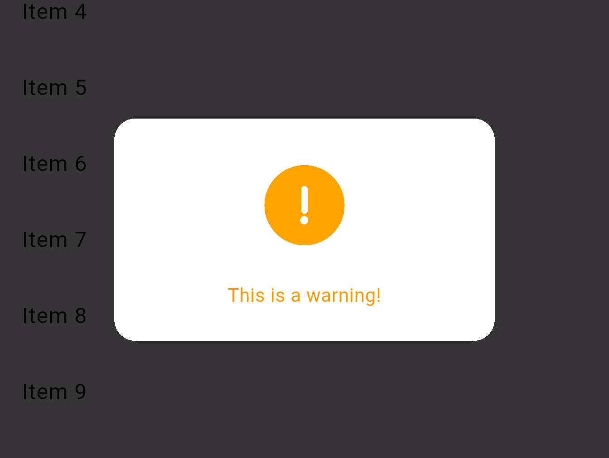
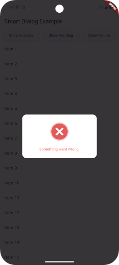
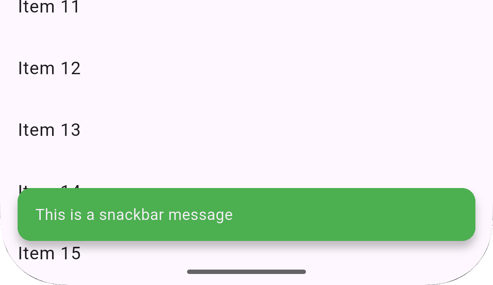
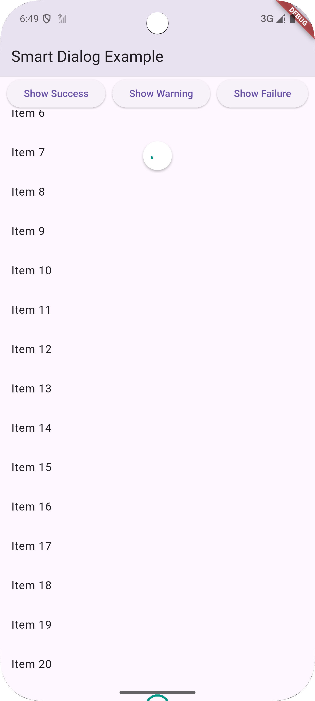
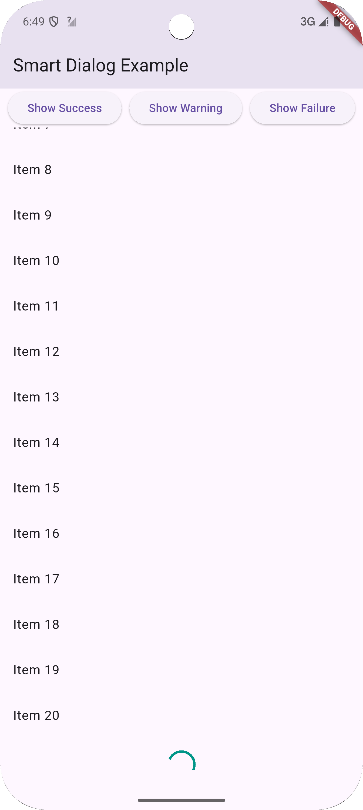

# Smart Progress Dialog

Smart Progress Dialog is a lightweight and customizable Flutter package that provides animated progress dialogs for loading, success, failure, and warning states. It also includes a controller, list loader for infinite scroll, pull-to-refresh support, and snackbars for lightweight feedback.

---

## ✨ Features

- ✅ SmartProgressDialog with loading, success, failure, and warning animations
- 🎮 SmartProgressController for managing dialog states
- 🔁 SmartRefreshIndicator for pull-to-refresh support
- 📦 SmartListLoader for infinite scroll lists
- 🍞 SmartSnackBar for quick toast-like user feedback
- 🎨 Customizable size, color, position, and message support

---

## 🚀 Installation

Add this to your `pubspec.yaml`:

```yaml
dependencies:
  smart_progress_dialog: ^0.0.6
```

Import it:
```dart
import 'package:images/images.dart';
```

---

## ✅ Tests

Smart Dialogs Plus includes complete widget and unit tests for the following:

- SmartProgressController
- SmartListLoader
- SmartProgressDialog
- SmartRefreshIndicator
- SmartSnackBar

To run tests:

```bash
flutter test
```

---

## 🧠 Usage

### 1. Show Loading Progress Dialog

```dart

SmartProgressDialog.startProgressDialog(
  context, // BuildContext
  color: Colors.black87, // Color of the progress dialog
  text: "Loading...", // Text to display in the dialog
);
```

---

### 2. Stop Progress Dialog

```dart

SmartProgressDialog.stopProgressDialog(
  context, // BuildContext
  SmartProgressState.success, // State of the dialog (success, error, warning)
  text: "Successful", // Text to display in the dialog
);

```

### 3. Infinite Scroll List Loader

```dart
SmartListLoader(isLoading: isLoadingMore)
```

### 4. Pull to Refresh

```dart
SmartRefreshIndicator(
  onRefresh: _refresh,
  child: ListView(...),
)
```

### 5. Show Snack bar

```dart
SmartSnackBar.show(
    context, message, {
    title: "Hello Title!",
    type: SmartSnackBarType.success,
    duration: SmartSnackBarDuration.short, // Duration of the snack bar: short, long, or indefinite
    backgroundColor: Colors.green, // Custom background color
    position: SmartSnackBarPosition.top, // Position of the snack bar: top or bottom
    showIcon: true, // Show icon based on type
    customIcon: Icons.check_circle, // Custom icon if showIcon is true
    showCloseIcon: false, // Show close icon
    closeIconColor: Colors.white, // Color of the close icon
    onClose: () { // Optional callback when snack bar is closed
      // Handle close
    },
    action: SnackBarAction( // Optional action button
    label: "Undo",
    onPressed: () {
      // Handle action
    },
    ),
);
```

---

## 📂 File Structure

```bash
lib/
├── images.dart         # Export entry
└── src/
    ├── images.dart     # Main dialog
    ├── smart_progress_controller.dart # Dialog controller
    ├── smart_list_loader.dart         # Scroll loader
    ├── smart_refresh_indicator.dart   # Refresh wrapper
    ├── smart_snack_bar.dart           # Snackbar utility
    └── dialog_state.dart              # Enum definition
```

---

## 📸 Screenshots

| Type      | Preview                        |
| --------- | ------------------------------ |
| Loading   |    |
| Success   |    |
| Warning   |    |
| Error     |      |
| Snackbar  |   |
| Refresh   |    |
| Load More |  |

---

## 📄 License

MIT License © 2025 Akika Digital

---

## 💡 Contributing

Got ideas for more widgets or improvements? Submit an issue or pull request on GitHub. Let’s make feedback in Flutter apps smarter — together!

---
