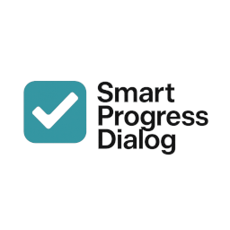
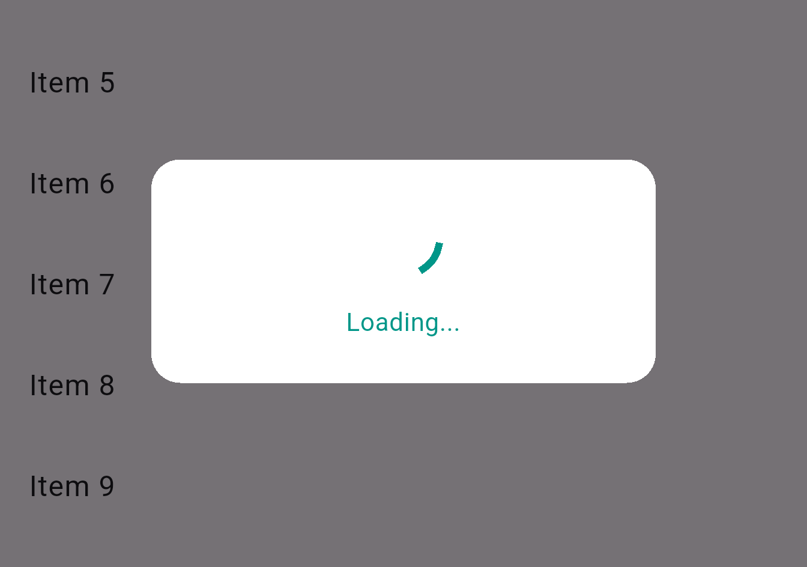

# Smart Progress Dialog

Smart Progress Dialog is a lightweight and customizable Flutter package that provides animated progress dialogs for loading, success, failure, and warning states. It also includes a controller, list loader for infinite scroll, pull-to-refresh support, and snackbars for lightweight feedback.



---

## ✨ Features

- ✅ SmartProgressDialog with loading, success, failure, and warning animations
- 🎮 SmartProgressController for managing dialog states
- 🔁 SmartRefreshIndicator for pull-to-refresh support
- 📦 SmartListLoader for infinite scroll lists
- 🍞 SmartSnackBar for quick toast-like user feedback
- 🎨 Customizable size, color, position, and message support

---

## 🚀 Installation

Add this to your `pubspec.yaml`:

```yaml
dependencies:
  smart_progress_dialog: ^1.0.0
```

Import it:
```dart
import 'package:smart_progress_dialog/smart_progress_dialog.dart';
```

---

## 🧠 Usage

### 1. Dialog With Controller

```dart
final controller = SmartProgressController();
controller.attach(context);

controller.showLoading("Loading...");
await Future.delayed(Duration(seconds: 2));
controller.showSuccess("Done!");
```

### 2. Inline Dialog Usage

```dart
showDialog(
  context: context,
  builder: (_) => SmartProgressDialog(
    state: SmartProgressState.warning,
    message: "Be careful!",
    color: Colors.orange,
  ),
);
```

### 3. Infinite Scroll List Loader

```dart
SmartListLoader(isLoading: isLoadingMore)
```

### 4. Pull to Refresh

```dart
SmartRefreshIndicator(
  onRefresh: _refresh,
  child: ListView(...),
)
```

### 5. Show Snackbar

```dart
SmartSnackBar.show(
  context,
  "Item saved!",
  state: SmartProgressState.success,
  position: SnackBarPosition.top, // or SnackBarPosition.bottom
  backgroundColor: Colors.indigo,
);
```

---

## 📂 File Structure

```bash
lib/
├── smart_progress_dialog.dart         # Export entry
└── src/
    ├── smart_progress_dialog.dart     # Main dialog
    ├── smart_progress_controller.dart # Dialog controller
    ├── smart_list_loader.dart         # Scroll loader
    ├── smart_refresh_indicator.dart   # Refresh wrapper
    ├── smart_snack_bar.dart           # Snackbar utility
    └── dialog_state.dart              # Enum definition
```

---

## 📸 Screenshots

- Here are some screenshots of the dialogs in action:

### Loading Dialog

- This dialog is shown when a process is loading.



### Success Dialog

- This dialog is shown when a process completes successfully.


### Warning Dialog

- This dialog is shown to alert the user about a warning or caution.


### Error Dialog

- This dialog is shown when an error occurs during a process.


### Pull to Refresh and Load More Dialogs

- These dialogs are used in conjunction with lists to refresh or load more data.


### Load More Dialog

- This dialog is shown when more data is being loaded in a list.


### Snackbar

- This dialog is shown when more data is being loaded in a list.


---

## 📄 License

MIT License © 2025 Akika Digital
